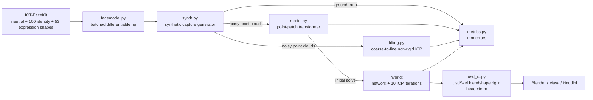

# Adaptive Neural Facial Deformer

**Solving raw 3D face scans into editable blendshape rigs: fast, robust to messy capture data,
and delivered as USD straight into Blender / Maya / Houdini.**

Performance capture gives you point clouds. Animators need rig controls. This project turns an
unordered, noisy, partially occluded facial scan into:

- **53 ARKit-style blendshape weights** (the controls an animator edits)
- **head pose** (rotation + translation)
- **identity** (the performer's neutral face shape)

It does this with a point-transformer network trained on endless synthetic captures, followed by
a short classical refinement. It is benchmarked head-to-head against a tuned non-rigid ICP
baseline on identical scans.

---

## The problem

A face rig is `face = neutral + Σ identity_i · I_i + Σ weight_j · E_j`, where `E_j` are sculpted
expression shapes (`jawOpen`, `mouthSmile_L`, …) and `weight_j ∈ [0, 1]`.

A scanner doesn't give you weights. It gives you a point cloud with:

| Capture problem | What it breaks |
|---|---|
| no vertex correspondence | you don't know which point is the nose tip |
| sensor noise (up to ~1 mm) | naive least squares chases noise |
| holes (hair, occluders, glare) | whole regions are unconstrained |
| outliers (background junk) | pulls fits off the surface |
| unknown head pose | correspondence and pose depend on each other |

Classical solvers (non-rigid ICP) alternate between guessing correspondences and solving for
parameters. They are accurate **if** they start close to the answer, and get stuck when they
don't. A learned solver sees thousands of variations in training and predicts a good answer
in one forward pass. A few ICP iterations then polish it.

## Architecture



### 1. Face model: `src/anfd/facemodel.py`
Loads [ICT-FaceKit](https://github.com/USC-ICT/ICT-FaceKit) (MIT): 26,719 vertices, 100 PCA
identity modes, 53 expression blendshapes with ARKit naming. It stores every shape as an offset
from neutral, so the whole rig is one matrix multiply. `TorchFaceModel` evaluates thousands of
faces per batch on the GPU and is differentiable, so training can backpropagate through the rig.

### 2. Synthetic capture: `src/anfd/synth.py`
Real scans with ground-truth rig weights are rare, so training data is generated on the fly on
the GPU. Each sample:

1. random identity `~ N(0, 1)`; sparse expression (≈18% of shapes active, 60% L/R-symmetric,
   5% fully neutral)
2. random head pose: yaw ±35°, pitch ±20°, roll ±10°, translation ±2 cm
3. area-weighted surface sampling → 4,096 unordered points (never on vertices)
4. corruption: back-face occlusion (70% of samples), up to 3 spherical holes, Gaussian noise
   σ ∈ [0, 1] mm, up to 2% outliers

The network never sees the same scan twice. Seeded, cached test sets make every method's
evaluation reproducible.

### 3. Classical baseline: `src/anfd/fitting.py`
A deliberately strong baseline, because beating a weak one proves nothing:

- trimmed closest-point correspondences (worst 10% rejected as outliers)
- weighted Procrustes (SVD) for the rigid update
- **point-to-plane** + light point-to-point residuals for identity/expression
- expression weights solved as a **box-constrained QP** (`0 ≤ w ≤ 1`) with FISTA, rather than
  clamping an unconstrained solution
- **coarse-to-fine schedule**: rigid-only → heavily regularised shape → fine shape. Without
  this, the solver bends identity/expression to absorb pose error and gets stuck.
- 5 yaw starts; the best is chosen by the fit's own residual (no ground truth is used)

### 4. Neural solver: `src/anfd/model.py`
A point-patch transformer (Point-MAE style), 5.4 M parameters:

```
4,096 points ─► farthest-point sample 256 centres ─► 32-NN patch around each
            ─► shared mini-PointNet per patch ─► 256 tokens (+ centre position embedding)
            ─► [CLS] + 6-layer Transformer encoder (dim 256, 8 heads)
            ─► head: 6D rotation │ translation │ 100 identity │ 53 sigmoid blendshape weights
```

- Rotation uses the continuous 6D representation (Zhou et al., CVPR 2019), which avoids
  the discontinuities of Euler angles and quaternions.
- The input is translation-normalised by its median, which is robust to outliers.
- Training loss is measured **on the mesh**, not only on the parameters: posed vertex error,
  pose-free vertex error, expression-only vertex error, weight L1 and rotation L1. Many weight
  combinations produce nearly identical faces, and the face is what the artist sees.
- bf16 autocast, AdamW, one-cycle LR schedule.

### 5. Hybrid solver: `src/anfd/solve.py`
Network prediction → 10 fine ICP iterations. The network removes the "bad starting pose"
failure mode; the refinement recovers sub-millimetre surface detail the network can't regress
exactly.

### 6. Pipeline integration: `src/anfd/usd_io.py`, `anfd-solve`, `Dockerfile`
The output is a **real rig**, not a baked mesh:

- `UsdSkelRoot` → base mesh with the solved identity baked in
- 53 sparse `UsdSkelBlendShape` targets (only the vertices each shape moves)
- `UsdSkelAnimation` with per-frame weight curves
- animated head transform on the root

A round-trip test re-evaluates the rig from the USD file independently and checks it against
the Python model to within 0.01 mm.

### 7. Metrics: `src/anfd/metrics.py`
All in millimetres on the face region:

| metric | meaning |
|---|---|
| `surface_mm` | posed mesh vs. true surface (what you'd see overlaid on the scan) |
| `expr_mm` | error caused by the expression weights alone, identity held at truth, i.e. what the animator inherits |
| `shape_mm` | pose-free identity + expression error |
| `weight_mae` | mean absolute blendshape weight error |
| `rot_deg` | head rotation error |

## Results

> Fill in after training: `uv run python scripts/evaluate.py --run solver --n 256` writes
> `runs/solver/results.md`. Paste the tables here, plus `runs/solver/demo/curves.png`.

_Pending the full training run._

## Quickstart

```bash
# 1. environment (Python 3.11, CUDA 12.8 PyTorch)
uv sync --extra dev

# 2. face model data (MIT licensed)
git clone --depth 1 https://github.com/USC-ICT/ICT-FaceKit.git external/ICT-FaceKit

# 3. tests (first run builds data/ict_model.npz, ~25 s)
uv run pytest -q

# 4. train (~2.5 h on an RTX 5060 laptop GPU; checkpoints every 2,000 steps)
uv run python scripts/train_solver.py --steps 40000 --batch 64 --run solver

# 5. head-to-head evaluation -> runs/solver/results.md
uv run python scripts/evaluate.py --run solver --n 256

# 6. Blender demo -> runs/solver/demo/scene.usda (File > Import > Universal Scene Description)
uv run python scripts/demo_usd.py --run solver --method hybrid
```

### Solve your own scans

```bash
uv run anfd-solve scans/ -o performance.usda --method hybrid --units mm --json weights.json
```

Inputs: `.ply` (ascii/binary), `.npy`, `.xyz`/`.txt`/`.csv`. A folder is read as a sequence
in filename order. Scans should be head-centred, Y up, face toward +Z. Identity is shared
across a sequence (one performer), so it is averaged across frames.

### Docker (CPU inference, runs anywhere: workstation, CI, AWS Batch/ECS)

```bash
docker build -t anfd .
docker run --rm -v "$PWD/scans:/in" -v "$PWD/out:/out" anfd /in -o /out/performance.usda --method neural
```

## Repository layout

```
src/anfd/
  facemodel.py   ICT model loading, npz cache, batched torch rig
  synth.py       GPU synthetic capture generator + seeded eval sets
  fitting.py     coarse-to-fine non-rigid ICP (baseline + refinement)
  model.py       point-patch transformer solver
  metrics.py     mm-based evaluation metrics
  solve.py       Solver API, point cloud readers, anfd-solve CLI
  usd_io.py      UsdSkel rig export, point cloud export, scene composition
src/anf_deformer/   rig data contracts for the corrective deformer (standard library only)
  data/schema.py         rig metadata: ordered controls, ranges, neutral values, vertex count
  data/sample.py         validated control-to-mesh pose samples
  data/serialization.py  versioned JSON interchange for rig metadata
  data/splits.py         sequence-level train/validation/test partitions (no leakage)
  geometry/topology.py   fixed mesh topology: triangle indices, vertex count
  cli.py                 anf-deformer validate-rig
scripts/
  train_solver.py   training loop
  evaluate.py       ICP vs neural vs hybrid, by noise level and head yaw
  demo_usd.py       synthetic performance -> truth / scan / solved USD scene + weight curves
tests/              rig maths, USD round-trip, Procrustes, ICP, network contract, PLY IO
tests/unit/         rig metadata, pose samples, serialization, splits, CLI
docs/               data contract formats and the validation guide
Dockerfile          CPU inference image
```

### Rig data contracts

The corrective deformer will train on control-to-mesh samples exported from a production rig,
so bad data has to be caught before training, not after. `anf_deformer.data` defines and
validates that data:

- **Rig metadata** ([format](docs/data/rig-metadata.md)): ordered control names, value ranges,
  neutral values, fixed vertex count and head-local coordinates, as versioned JSON.
- **Pose samples**: one control vector plus the mesh it produces, checked against the metadata.
- **Mesh topology** (`anf_deformer.geometry.MeshTopology`): validates ordered triangle indices
  and checks the vertex count against the rig schema. Exporters must also keep vertex order
  identical across all poses; matching counts alone cannot prove that.
- **Sequence splits** ([contract](docs/data/sequence-splits.md)): whole animation sequences are
  assigned to train, validation or test, so frames from one performance never leak across sets.

```bash
uv run anf-deformer validate-rig path/to/rig.json
```

See the [validation guide](docs/guides/metadata-validation.md) for exit codes.

## Limitations

- **Synthetic-only training.** Real capture has sensor-specific artifacts (structured-light
  striping, photogrammetry smoothing, hair) that the corruption model only approximates.
  Real-scan validation is the next step.
- **Linear rig.** The ICT model is linear blendshapes. Real skin isn't. The solver is only as
  good as the rig can express, which motivates the corrective deformer below.
- **Blendshape ambiguity.** Different weight mixes can produce near-identical surfaces, so
  `weight_mae` can rise while `surface_mm` falls. Both are reported for that reason.
- **Per-frame solve.** No temporal model yet, so jitter isn't suppressed across frames.

## Roadmap

1. **Neural corrective deformer:** learn the per-vertex residual the linear rig can't express
   (e.g. cheek bulge when smiling with the jaw open), conditioned on the solved weights, and
   export it as corrective shapes. Training data flows through the rig data contracts above,
   and it will be compared against simpler baselines rather than assumed to help.
2. **Temporal solver:** a sequence model over frames for smooth, jitter-free curves.
3. **Landmark tracking** from images to give the solver a camera-space pose prior.
4. **Inference optimisation:** ONNX / TensorRT export and batch-1 latency work
   (the farthest-point sampling loop dominates).
5. **Maya / Houdini importers** that load the solved USD straight into production rigs.

## Credits

Face model: [ICT-FaceKit](https://github.com/USC-ICT/ICT-FaceKit), USC Institute for Creative
Technologies (MIT License). Point-patch tokenisation follows Point-MAE (Pang et al., ECCV
2022); 6D rotation representation from Zhou et al., CVPR 2019.
