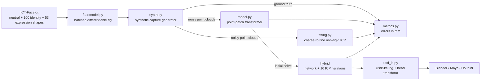

# Adaptive Neural Facial Deformer


**Point clouds in. Rig sliders out.**

A face scanner hands you thousands of unlabeled, noisy points. An animator needs 53 sliders.
This project solves one into the other: from a raw, partial, arbitrarily posed 3D face scan it
recovers the **53 ARKit-style blendshape weights**, the **head pose** and the performer's
**identity**, then writes the result as a USD rig with editable blend shapes and animation
curves that opens in Blender, Maya or Houdini.

A point-patch transformer trained on endless synthetic captures does the heavy lifting. A short
classical refinement adds the last millimetre. Both are measured head-to-head against a tuned
non-rigid ICP solver on identical scans.

## Contents

- [Built with](#built-with)
- [Why this exists](#why-this-exists)
- [What it does](#what-it-does)
- [How it fits a character pipeline](#how-it-fits-a-character-pipeline)
- [Architecture](#architecture)
- [Design decisions worth knowing](#design-decisions-worth-knowing)
- [Quick start](#quick-start)
- [The demo](#the-demo)
- [Command line](#command-line)
- [Data model](#data-model)
- [Rig data contracts](#rig-data-contracts)
- [Testing](#testing)
- [Benchmark](#benchmark)
- [Known limitations](#known-limitations)
- [Roadmap](#roadmap)
- [Repository layout](#repository-layout)
- [Author](#author)

## Built with

| Area | What |
|---|---|
| Face model | [ICT-FaceKit](https://github.com/USC-ICT/ICT-FaceKit) (MIT): 26,719 vertices, 100 PCA identity modes, 53 expression blend shapes with ARKit names |
| Learning | PyTorch 2.11 on CUDA 12.8, bf16 autocast, AdamW with a one-cycle schedule |
| Network | Point-patch transformer, 5.4 M parameters: farthest-point sampling, k-NN patches, mini-PointNet tokens, 6-layer encoder, 6D rotation head |
| Classical solver | Batched non-rigid ICP on the GPU: trimmed correspondences, weighted Procrustes, point-to-plane least squares, FISTA box-constrained QP |
| Pipeline | OpenUSD (`usd-core` 26.8): `UsdSkelBlendShape`, `UsdSkelAnimation`, animated head transform, composed review scene |
| Data contracts | Standard-library rig metadata, pose samples, mesh topology and sequence splits (`anf_deformer`) |
| Packaging | uv + hatchling, two command-line tools, a CPU inference Docker image |
| Tests | pytest and unittest, 34 tests, ruff |
| Hardware | Trained on a single RTX 5060 Laptop GPU (8 GB) |

## Why this exists

A face rig is linear: `face = neutral + Σ identity_i · I_i + Σ weight_j · E_j`, where each
`E_j` is a sculpted shape such as `jawOpen` or `mouthSmile_L` and each `weight_j` lives in
`[0, 1]`. Going from sliders to a face is one matrix multiply. Going from a *scan* to sliders
is the hard direction, and it is the one performance capture needs every frame.

A scan does not arrive as a mesh with known vertices. It arrives as a point cloud:

| Capture problem | What it breaks |
|---|---|
| No vertex correspondence | Nothing says which point is the nose tip |
| Sensor noise (up to ~1 mm) | Plain least squares fits the noise |
| Holes from hair, hands and glare | Whole regions are unconstrained |
| Outliers from the background | Fits are pulled off the surface |
| Unknown head pose | Pose and correspondence depend on each other |
| Self-occlusion | A turned head hides one cheek entirely |

Classical solvers (non-rigid ICP) alternate between guessing correspondences and solving for
parameters. They are precise when they start near the answer and get stuck when they do not.
A learned solver has seen millions of turned, noisy, holed faces and lands near the answer in
one forward pass. Combining the two gives both properties.

## What it does

Three solvers share one interface, `Solver.solve(points, method)`:

| Method | What happens | Speed |
|---|---|---|
| `icp` | Coarse-to-fine non-rigid ICP from five head-yaw starts; the best fit is chosen by its own residual, never by ground truth | ~1.3 s per scan |
| `neural` | One forward pass of the point-patch transformer predicts rotation, translation, identity and 53 weights | ~2 ms per scan (batched) |
| `hybrid` | The network's prediction seeds 10 fine ICP iterations | ~80 ms per scan |

Every method returns the same four things: a 3×3 head rotation, a translation in centimetres,
100 identity coefficients and 53 blendshape weights in `[0, 1]`. A sequence of scans becomes
one USD file: identity averaged across the performance, weights animated per frame, head
motion on the root transform.

## How it fits a character pipeline

| Pipeline need | Where it lives |
|---|---|
| Predict blendshape weights from capture | `src/anfd/solve.py`, `src/anfd/model.py` |
| Train on noisy raw capture, not only clean assets | `src/anfd/synth.py` corruption model |
| Keep the result editable by artists | `src/anfd/usd_io.py`: real blend shapes and curves, not a baked vertex cache |
| Move data between DCC tools | OpenUSD; UsdSkel's own binding query confirms all 53 blend shapes bound under each `SkelRoot` |
| Prove it beats the established method | `scripts/evaluate.py` against a tuned ICP solver on seeded, identical scans |
| Run the same environment anywhere | `Dockerfile` (CPU inference) and a locked `uv.lock` |
| Catch bad training data before training | `anf_deformer` rig metadata, topology and split contracts |

## Architecture



Eight layers, each small enough to read in one sitting:

| Layer | Responsibility | Code |
|---|---|---|
| 1. Rig | Load ICT-FaceKit once into an `.npz` cache; evaluate thousands of faces per batch as one matrix multiply, differentiably | `src/anfd/facemodel.py` |
| 2. Capture simulation | Random identity, sparse expression and head pose, then area-weighted surface sampling, occlusion, holes, noise and outliers, all on the GPU | `src/anfd/synth.py` |
| 3. Classical solver | Trimmed correspondences, Procrustes, point-to-plane least squares, box-constrained QP, coarse-to-fine schedule | `src/anfd/fitting.py` |
| 4. Neural solver | Point-patch transformer with a 6D rotation head and sigmoid weights | `src/anfd/model.py` |
| 5. Training | Mesh-space losses on endless fresh scans, fixed seeded evaluation sets | `scripts/train_solver.py` |
| 6. Evaluation | Millimetre metrics, method comparison, breakdown by head yaw | `src/anfd/metrics.py`, `scripts/evaluate.py` |
| 7. Pipeline I/O | Point cloud readers, UsdSkel export, `anfd-solve`, Docker | `src/anfd/solve.py`, `src/anfd/usd_io.py` |
| 8. Data contracts | Validated rig metadata, pose samples, topology and splits for the corrective deformer | `src/anf_deformer/` |

### The network

```
4,096 points ─► farthest-point sample 256 centres ─► 32 nearest neighbours around each
            ─► shared mini-PointNet per patch (max-pooled, order-invariant) ─► 256 tokens
            ─► + position embedding of each centre ─► [CLS] + 6-layer Transformer (dim 256, 8 heads)
            ─► 6D rotation │ translation │ 100 identity │ 53 sigmoid blendshape weights
```

The input is shifted by its median point first, so the network sees shape rather than position
and a few junk points cannot drag the centre. The design follows Point-MAE (Pang et al., ECCV
2022); the rotation head uses the continuous 6D representation of Zhou et al. (CVPR 2019).

## Design decisions worth knowing

**A strong baseline or nothing.** The first ICP version was off by nearly 6 mm even when handed
the true head pose. Three fixes brought that to 0.9 mm: point-to-plane residuals (vertices are 3.4 mm
apart, so point-to-vertex matching has built-in error), bounds enforced inside the solve instead
of clamping afterwards, and a regularisation weight tuned by sweep instead of guessed. The
network is only compared against this corrected version.

**Coarse to fine.** From a wrong starting pose, a weakly regularised fit bends identity and
expression to absorb the pose error and settles near 12 mm. The schedule runs 8 rigid-only
iterations, 10 heavily regularised shape iterations, then 22 fine ones: pose first, coarse shape
second, detail last.

**Bounds inside the solve.** Blend shapes overlap: left and right smile, cheek squint, dimple.
Clamping an unconstrained least-squares answer leaves the compensation of a clamped weight
spread across its neighbours. The expression step is a box-constrained QP solved with FISTA,
step size from the largest eigenvalue of the normal matrix.

**Grade the mesh, not the numbers.** Different weight mixes can produce nearly the same face.
Training loss is measured on posed vertices, pose-free vertices and expression-only vertices,
with weight and rotation terms on top, so a harmless weight difference is not punished and the
face the artist sees is what gets optimised.

**Surface samples, never vertices.** Scan points are drawn at random positions inside triangles,
weighted by area. A network trained on vertex positions could learn vertex identity as a
shortcut that no real scanner provides.

**Endless data, fixed tests.** Every training step generates 64 new scans on the GPU, so nothing
is memorised. Evaluation uses seeded scan sets cached on disk, so every method is scored on
exactly the same inputs, and a test checks that the same seed regenerates identical scans.

**Output a rig, not a mesh.** The export is a `SkelRoot` with a base mesh, 53 sparse
`UsdSkelBlendShape` targets, a `UsdSkelAnimation` of weights and an animated head transform.
A round-trip test rebuilds the face from the USD file alone and matches the Python rig to
within 0.01 mm, head pose included.

**Identity belongs to the performer.** Identity is solved per frame but averaged across a
sequence before export, because one actor's face shape does not change between frames.

## Quick start

Requirements: Python 3.11, [uv](https://docs.astral.sh/uv/), an NVIDIA GPU for training
(inference also runs on CPU).

```bash
uv sync --extra dev
git clone --depth 1 https://github.com/USC-ICT/ICT-FaceKit.git external/ICT-FaceKit
uv run pytest -q
```

The first test run parses the 154 ICT meshes into `data/ict_model.npz` (about 25 s); every run
after that loads it instantly.

Train, evaluate and build the demo:

```bash
uv run python scripts/train_solver.py --steps 40000 --batch 64 --run solver
uv run python scripts/evaluate.py --run solver --n 256
uv run python scripts/demo_usd.py --run solver --method hybrid
```

Training takes about two hours on an RTX 5060 Laptop GPU (0.18 s per step, 3.3 GB peak) and
checkpoints every 2,000 steps. Evaluation writes `runs/solver/results.md`.

| Variable | Purpose |
|---|---|
| `ANFD_MODEL` | Path of the cached face model, default `data/ict_model.npz`; set inside the Docker image |

## The demo

`scripts/demo_usd.py` synthesises a four-second performance: expressions keyframed every half
second with smoothstep blending, a slow head turn of ±25° and a nod of ±8°. Every frame is
scanned with the full corruption model, solved, and written to `runs/solver/demo/`:

| File | Contents |
|---|---|
| `truth.usda` | The ground-truth rig and animation |
| `scan.usda` | The raw point clouds the solver saw, as animated `UsdGeomPoints` |
| `solved.usda` | The solved rig: 53 editable blend shapes, weight curves, head transform |
| `scene.usda` | All three side by side, 30 cm apart, composed by reference |
| `curves.png` | Truth against solved weight curves for the six most active shapes |

Open `scene.usda` in Blender (File, Import, Universal Scene Description) or `usdview` and scrub
the timeline to compare the solved head with the truth, frame by frame.

## Command line

```bash
uv run anfd-solve scans/ -o performance.usda --method hybrid --units mm --json weights.json
uv run anf-deformer validate-rig path/to/rig.json
```

`anfd-solve` reads `.ply` (ascii and binary), `.npy`, `.xyz`, `.txt` and `.csv`. A folder is a
sequence in filename order. Scans are expected head-centred, Y up, face toward +Z; `--units`
converts from millimetres or metres. `--json` also writes per-frame weights by name.

Docker runs the same solver anywhere, CPU only:

```bash
docker build -t anfd .
docker run --rm -v "$PWD/scans:/in" -v "$PWD/out:/out" anfd /in -o /out/performance.usda --method neural
```

## Data model

What every solver returns, batched:

```python
{
    "rot":   Tensor[B, 3, 3],   # head rotation about the face centre
    "trans": Tensor[B, 3],      # head translation, cm
    "id_w":  Tensor[B, 100],    # identity coefficients, ~N(0, 1)
    "ex_w":  Tensor[B, 53],     # blendshape weights in [0, 1], ICT/ARKit names
}
# posed = (rig(id_w, ex_w) - centre) @ rot.T + centre + trans
```

The capture model is one dataclass, so every corruption is explicit and adjustable:

```python
@dataclass
class CaptureConfig:
    n_points: int = 4096
    noise_cm: tuple[float, float] = (0.0, 0.1)      # per-scan Gaussian sigma, 0 to 1 mm
    max_holes: int = 3
    hole_radius_cm: tuple[float, float] = (0.8, 2.5)
    outlier_frac: tuple[float, float] = (0.0, 0.02)
    yaw_deg: float = 35.0
    pitch_deg: float = 20.0
    roll_deg: float = 10.0
    trans_cm: float = 2.0
    occlusion_prob: float = 0.7                     # single-view vs multi-view capture
```

## Rig data contracts

The corrective deformer on the roadmap will train on control-to-mesh samples exported from a
production rig, so bad data has to be caught before training, not after. `anf_deformer.data`
and `anf_deformer.geometry` define and validate that data using only the standard library:

- **Rig metadata** ([format](docs/data/rig-metadata.md)): ordered control names, value ranges,
  neutral values, fixed vertex count and head-local coordinates, as versioned JSON.
- **Pose samples**: one control vector and the mesh it produces, checked against the metadata.
- **Mesh topology** (`MeshTopology`): validated triangle indices and a vertex count matched to
  the rig schema. Exporters must also keep vertex order identical across poses; matching counts
  alone cannot prove that.
- **Sequence splits** ([contract](docs/data/sequence-splits.md)): whole animation sequences go
  to train, validation or test, so frames from one performance never leak across sets.

See the [validation guide](docs/guides/metadata-validation.md) for exit codes.

## Testing

```bash
uv run pytest -q
```

| Suite | What it proves |
|---|---|
| Rig | Model shapes; the torch rig matches the numpy rig |
| USD | Round trip through a real USD file, head pose included, within 0.01 mm |
| Capture | Correct shapes, finite values, weights in `[0, 1]`, same seed gives identical scans |
| Geometry | Yaw extraction inverts the Euler build; Procrustes recovers a known rigid motion |
| ICP | From the true pose, clean scans solve to under 2 mm (median) |
| Network | Output rotations are orthonormal with determinant 1; weights stay in `[0, 1]` |
| IO | ASCII and binary PLY readers |
| Contracts | Rig metadata, pose samples, serialization, topology, splits and the validator CLI |

## Benchmark

`scripts/evaluate.py` scores every method on the same seeded synthetic scans. Errors are mean
distances in millimetres over the 7,801-vertex face region.

| Metric | Meaning |
|---|---|
| Surface | Posed mesh against the true surface, what you see overlaid on the scan |
| Expression | Error from the expression weights alone, identity held at truth: what the animator inherits |
| Weight MAE | Mean absolute blendshape weight error |

**Preliminary results**, from a model trained for 600 steps (about two minutes) and 32 noisy
scans. The full 40,000-step run replaces this table.

| Method | Surface mm | Surface p90 | Expression mm | Weight MAE | Rotation ° | ms per scan |
|---|---|---|---|---|---|---|
| ICP, 5 starts | 4.00 | 7.62 | 2.76 | 0.231 | 3.01 | 1,334 |
| Neural | 5.36 | 6.47 | 1.87 | 0.077 | 2.25 | 2 |
| **Hybrid** | **2.59** | **3.74** | **1.61** | 0.148 | 1.97 | 79 |
| ICP given the true pose (upper bound) | 1.16 | 1.83 | 0.80 | 0.112 | 0.77 | 338 |

Surface error by how far the head is turned:

| Method | Yaw 0–10° | Yaw 10–20° | Yaw 20–35° |
|---|---|---|---|
| ICP, 5 starts | 2.81 | 4.19 | 5.07 |
| Hybrid | 2.64 | 2.02 | 2.92 |

The yaw table is the story. ICP degrades as the head turns because its starting pose gets
worse; the hybrid stays flat because the network supplies the pose. The upper-bound row shows
the same thing from the other side: given the true pose, ICP is excellent, so the pose is the
bottleneck the network removes. The hybrid is 17 times faster than ICP and more accurate even
with two minutes of training.

One honest oddity: the hybrid's weight error is higher than the network's alone while its
surface error is lower. Blend shapes overlap, so the refinement trades toward the weight mix
that fits the surface best. A prior that keeps refined weights near the network's prediction
is the planned fix.

## Known limitations

- **Synthetic training only.** Real scanners add their own artifacts (structured-light striping,
  photogrammetry smoothing, hair). The corruption model approximates them; validation on real
  captures is the next step.
- **Linear rig.** ICT-FaceKit is linear blend shapes and real skin is not. The solver can only
  express what the rig can, which is what the corrective deformer addresses.
- **Per-frame solving.** There is no temporal model yet, so frame-to-frame jitter is not
  suppressed.
- **Batch-1 latency.** Farthest-point sampling is a 256-step loop; at batch size 1 it dominates
  inference time.
- **Head-centred input.** Scans must arrive roughly centred with Y up and the face toward +Z.

## Roadmap

1. **Neural corrective deformer:** learn the per-vertex residual the linear rig cannot express
   (the cheek bulge when smiling with the jaw open), conditioned on the solved weights, fed by
   the rig data contracts, and compared against simpler baselines rather than assumed to help.
2. **Temporal solver** for smooth, jitter-free curves across a performance.
3. **Landmark tracking** from images as a camera-space pose prior.
4. **Inference optimisation:** ONNX and TensorRT export, CUDA graphs for the sampling loop.
5. **Maya and Houdini importers** that load the solved USD straight into production rigs.

## Repository layout

```
src/
  anfd/
    facemodel.py     ICT model loading, npz cache, batched differentiable rig
    synth.py         GPU capture generator and seeded evaluation sets
    fitting.py       coarse-to-fine non-rigid ICP, Procrustes, FISTA box QP
    model.py         point-patch transformer solver
    metrics.py       millimetre evaluation metrics
    solve.py         Solver API, point cloud readers, anfd-solve
    usd_io.py        UsdSkel rig export, point cloud export, scene composition
  anf_deformer/
    data/            rig metadata, pose samples, JSON interchange, sequence splits
    geometry/        fixed mesh topology
    cli.py           anf-deformer validate-rig
scripts/
  train_solver.py    training loop
  evaluate.py        ICP, neural and hybrid compared by noise level and head yaw
  demo_usd.py        synthetic performance to a truth, scan and solved USD scene
tests/               rig, USD, capture, geometry, ICP, network and IO tests
tests/unit/          data contract tests
docs/                data contract formats and the validation guide
Dockerfile           CPU inference image
```

## Author

Fahad Nafees Ahmed

Face model: [ICT-FaceKit](https://github.com/USC-ICT/ICT-FaceKit), USC Institute for Creative
Technologies, MIT License. Point-patch tokenisation after Point-MAE (Pang et al., ECCV 2022).
6D rotation representation after Zhou et al. (CVPR 2019).
